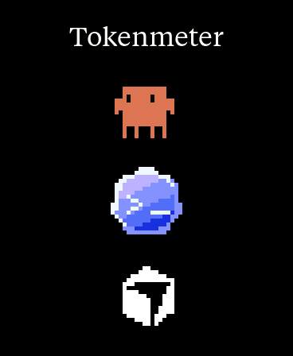
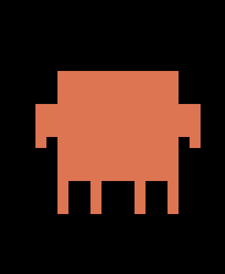
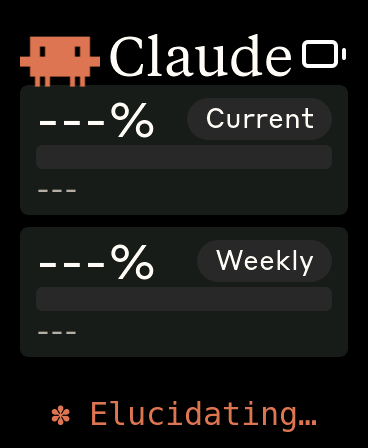
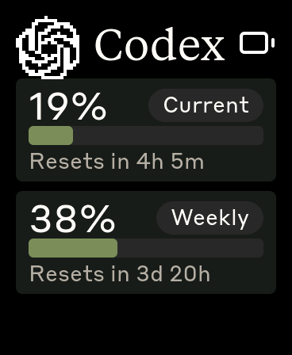
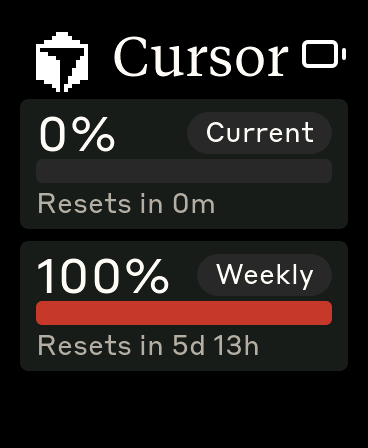

# Tokenmeter

An ESP32 desk display that tracks **Claude Code, OpenAI Codex, and Cursor** usage in one little gadget.

> **Unofficial personal project.** Tokenmeter is not affiliated with, endorsed
> by, or sponsored by Anthropic, OpenAI, Anysphere/Cursor, or Waveshare. Their
> names are used only to identify compatible services.

Inspired by — and built on top of — [HermannBjorgvin/Clawdmeter](https://github.com/HermannBjorgvin/Clawdmeter), a lovely Claude Code usage meter. Tokenmeter extends it to three services:

- **Three services, three screens** — boot into a selector with animated pixel characters (Clawd, the blue-purple Codex character, and the Cursor cube); tap one for that service's animation splash, then tap again for its usage page in the original Clawdmeter layout.
- **Multi-source daemon (macOS)** — alongside the Claude API poller, the daemon reads Codex rate limits from local `~/.codex` session logs and Cursor usage from the Cursor dashboard API, and ships everything in one backward-compatible BLE payload (`svc` object).
- **Per-brand UI** — each service keeps its own pixel art and styling; the whimsical spinner verbs stay Claude-only.
- **BLE name** is `Tokenmeter`.
- Tested on the **Waveshare ESP32-S3-Touch-AMOLED-1.8** (`waveshare_amoled_18` env).

### Tokenmeter screens

All images below are native 368×448 framebuffer captures from the
Waveshare AMOLED 1.8 device.

| Selector | Claude animation | Claude usage |
| :------: | :--------------: | :----------: |
|  |  |  |

| Codex usage | Cursor animation | Cursor usage |
| :---------: | :--------------: | :----------: |
|  |  |  |

### Codex animation set

The Codex splash uses one consistent blue-purple character with three original
movement loops. It opens on **Terminal**, rotates automatically every 20
seconds according to the current Codex usage-rate group, and can be cycled
manually with the PWR button.

| Terminal | Happy | Look around |
| :------: | :---: | :---------: |
|  |  |  |

Native 368×448 framebuffer recordings captured directly from the device:

- [Codex terminal animation](screenshots/amoled_18/codex-terminal-animation.mp4)
- [Codex happy animation](screenshots/amoled_18/codex-happy-animation.mp4)
- [Codex look-around animation](screenshots/amoled_18/codex-look-around-animation.mp4)
- [Cursor animation](screenshots/amoled_18/cursor-animation.mp4)

> **Third-party marks and artwork:** the screenshots and firmware display
> Anthropic/Claude, OpenAI, and Cursor artwork. Those assets remain the
> property of their respective owners. Their presence here does not grant a
> license to reuse them or imply endorsement. See
> [Rights and redistribution status](#rights-and-redistribution-status) before
> copying, publishing builds, or selling hardware.

The original Clawdmeter README follows — its flashing, pairing, and daemon instructions all still apply (use the `waveshare_amoled_18` env and the multi-service daemon in `daemon/`).

---

# Clawdmeter

A small ESP32 dashboard I made for my desk to keep an eye on Claude Code usage.

It runs on a [Waveshare ESP32-S3-Touch-AMOLED-2.16](https://www.waveshare.com/esp32-s3-touch-amoled-2.16.htm?&aff_id=149786) as well as a few other alternative boards and pairs over Bluetooth, the splash screen plays pixel-art Clawd animations that get
busier when your usage rate climbs. The side buttons send Space (and Shift+Tab on the 2.16) over BLE HID for Claude Code's voice mode and mode-toggle shortcuts.

|              Usage meter              |              Clawd animation screen              |
| :-----------------------------------: | :----------------------------------------------: |
|  |  |

The Clawd animations come from [claudepix](https://claudepix.vercel.app), [@amaanbuilds](https://x.com/amaanbuilds)'s library of pixel-art Clawd sprites, check it out, it's lovely.

## Screens

The device boots into the splash. Tap the screen anywhere to switch to the Usage view; tap again to flip back to the splash.

|              Splash               |              Usage              |
| :-------------------------------: | :-----------------------------: |
|  |  |
|   Splash; touch-toggle anytime    | Session and weekly utilization  |

While the splash is up, the middle (PWR) button cycles animations. **Hold the power button for 3 seconds, then release, to put the device into pairing mode** — this clears the saved Bluetooth bond and re-advertises. The firmware also auto-rotates animations every 20 s within the current usage-rate group, so a long stretch on the splash isn't just one Clawd on loop.

## Hardware

Boards supported out of the box:

- [Waveshare ESP32-S3-Touch-AMOLED-2.16](https://www.waveshare.com/esp32-s3-touch-amoled-2.16.htm?&aff_id=149786)
- [Waveshare ESP32-C6-Touch-AMOLED-2.16](https://www.waveshare.com/esp32-c6-touch-amoled-2.16.htm?&aff_id=149786) 
- [Waveshare ESP32-S3-Touch-AMOLED-1.8](https://www.waveshare.com/esp32-s3-touch-amoled-1.8.htm?&aff_id=149786)

> Please check if a pull request exists for your alternative hardware port before opening a new one, providing QA feedback and testing on the same hardware is more valuable than duplicate pull requests.

**Porting to another board:** the firmware is a thin HAL with per-board folders under `firmware/src/boards/`. Drop in a new folder and a new PlatformIO env — `main.cpp`, `ui.cpp`, and `splash.cpp` never need to change. See [`docs/porting/adding-a-board.md`](docs/porting/adding-a-board.md) for the walk-through and [`docs/porting/hal-contract.md`](docs/porting/hal-contract.md) for the interfaces a port must implement.

## Prerequisites

- Linux (tested on Ubuntu), macOS, or Windows 10/11
- [PlatformIO CLI](https://docs.platformio.org/en/latest/core/installation/index.html)
- Linux: `curl`, `bluetoothctl`, `busctl` (BlueZ Bluetooth stack)
- macOS: `python3` (the installer sets up a venv with `bleak` and `httpx`)
- Windows: `python3` 3.11+ (the installer sets up a venv with `bleak`, `httpx`, and `pystray`)
- Claude Code with an active subscription

## macOS installation

The macOS host pieces — Python daemon, LaunchAgent, and flash helper — were ported by [Chris Davidson (@lorddavidson)](https://github.com/lorddavidson). Thanks Chris!

### Flash the firmware

```bash
./flash-mac.sh waveshare_amoled_216                       # auto-detects /dev/cu.usbmodem*
./flash-mac.sh waveshare_amoled_18  /dev/cu.usbmodem1101  # or pass an explicit USB serial port
```

The board env name is required. Run `./flash-mac.sh` with no args to see the available envs (scraped from `firmware/platformio.ini`).

### Pair the device

After flashing, open **System Settings → Bluetooth** and click *Connect* next to "Clawdmeter". The daemon will discover it on its next scan (~30 s).

### Install the daemon

The daemon reads your Claude OAuth token from the macOS Keychain (service `Claude Code-credentials`), polls usage every 60 s, and pushes it to the display over BLE.

```bash
./install-mac.sh
```

The installer creates a Python venv in `daemon/.venv/`, installs `bleak` and `httpx`, renders a LaunchAgent into `~/Library/LaunchAgents/com.user.claude-usage-daemon.plist`, and loads it. The first run is launched interactively so macOS prompts for Bluetooth permission.

Useful commands:

```bash
launchctl list | grep claude-usage                                          # check it's running
tail -F ~/Library/Logs/claude-usage-daemon.out.log                          # live logs
launchctl unload ~/Library/LaunchAgents/com.user.claude-usage-daemon.plist  # stop
launchctl load -w ~/Library/LaunchAgents/com.user.claude-usage-daemon.plist # start
```

## Linux installation

### Flash the firmware

```bash
./flash.sh waveshare_amoled_216                  # defaults to /dev/ttyACM0
./flash.sh waveshare_amoled_18  /dev/ttyACM1     # or pass an explicit USB serial port
```

The board env name is required. Run `./flash.sh` with no args to see the available envs (scraped from `firmware/platformio.ini`).

### Pair the device

After flashing, the device advertises as "Clawdmeter". Pair it once:

```bash
# Scan for the device
bluetoothctl scan le

# When "Clawdmeter" appears, pair and trust it
bluetoothctl pair F4:12:FA:C0:8F:E5    # use your device's MAC
bluetoothctl trust F4:12:FA:C0:8F:E5
```

To re-pair later, hold the power button for 3 seconds then release — the device clears its saved bond and re-advertises.

### Install the daemon

The daemon polls your Claude usage every 60 seconds and sends it to the display over BLE.

```bash
./install.sh
systemctl --user start claude-usage-daemon
```

Check status: `systemctl --user status claude-usage-daemon`

View logs: `journalctl --user -u claude-usage-daemon -f`

## Windows installation

Runs natively on Windows — no WSL required. A system-tray app polls your usage and pushes it over BLE, and starts automatically at login.

### Prerequisites

- **Native Windows** (not WSL).
- **Python 3.11+** from [python.org](https://www.python.org/downloads/) — check *"Add python.exe to PATH"* during install.
- **Claude Code** installed, with `claude login` completed. The token is read from `%USERPROFILE%\.claude\.credentials.json` (falling back to `%LOCALAPPDATA%\Claude\` then `%APPDATA%\Claude\`).
- The repo on a **native Windows path** (e.g. `%USERPROFILE%\Clawdmeter`), **not** a `\\wsl$` share — the installer refuses a WSL path.

### Flash the firmware

```powershell
pio run -d firmware -e waveshare_amoled_216 -t upload --upload-port COM5   # use your device's COM port
```

Run `pio run -d firmware` with no env to see the available board envs.

### Pair the device

The device is a bonded BLE HID keyboard, so pair it once: **Settings → Bluetooth & devices → Add device → Bluetooth**, then select "Claude Controller". Pairing is **required** — it enables the physical buttons and keeps a persistent connection (the device keeps showing your last-synced usage even after the daemon quits). To undo, use **Remove device** (this disables the buttons).

### Install the daemon (recommended)

From the repo root in PowerShell:

```powershell
powershell -ExecutionPolicy Bypass -File install-windows.ps1
```

This creates a venv, installs `bleak`/`httpx`/`pystray`/`Pillow` from the in-repo requirements (no internet downloads), registers a per-user login-autostart entry (`HKCU\…\Run`, no admin needed), and launches the tray app headlessly (no console window).

### Run manually instead (optional)

```powershell
python -m venv .venv
.venv\Scripts\Activate.ps1        # if blocked: Set-ExecutionPolicy -Scope CurrentUser RemoteSigned, then retry
pip install -r daemon\requirements-windows.txt
python daemon\claude_usage_daemon_windows.py        # runs in the foreground; Ctrl+C to stop
```

### Tray icon and menu

The icon's corner bubble shows state — **green** Connected, **amber** Scanning, **red** Error — and hovering shows the status (`Connected · last update HH:MM`). A notification fires once when it enters Error (e.g. an expired token). Right-click for the menu:

- **Status header** — live state + last sync time.
- **Start at login** — toggle autostart on/off.
- **Quit** — stops the daemon cleanly; leaves the Windows pairing intact (device keeps its last reading).

### Logs and troubleshooting

```powershell
Get-Content $env:LOCALAPPDATA\Clawdmeter\daemon.log -Tail 30        # view logs
reg delete "HKCU\Software\Microsoft\Windows\CurrentVersion\Run" /v Clawdmeter /f   # remove autostart
```

| Symptom | Fix |
|---------|-----|
| `Device not found` | Power on the device; make sure it's in range and paired. |
| `token expired` toast / `API HTTP 401` | Re-run `claude login`, then restart the daemon. |
| `Connection failed` | Toggle Windows Bluetooth off/on in Settings. |
| `Warning: running under Linux/WSL` | Run from a native PowerShell window, not a WSL shell. |

## How it works

1. The daemon reads your Claude Code OAuth token — from the macOS Keychain (service `Claude Code-credentials`) on macOS, or from `~/.claude/.credentials.json` on Linux (`%USERPROFILE%\.claude\.credentials.json` on Windows).
2. It makes a minimal API call to `api.anthropic.com/v1/messages` — one token of Haiku, basically free.
3. The usage numbers come straight out of the response headers (`anthropic-ratelimit-unified-5h-utilization` and friends).
4. The daemon connects to the ESP32 over BLE and writes a JSON payload to the GATT RX characteristic.
5. The firmware parses it and updates the LVGL dashboard.
6. The firmware also tracks the rate of change of session % over a 5-minute window and picks splash animations from the matching mood group.
7. The side buttons are independent of all of this — they send Space and (on boards with a third button) Shift+Tab as BLE HID keyboard input to the paired host directly.

## Physical buttons

Button layout depends on the board:

**AMOLED-2.16 (S3 and C6)** — three side buttons:

| Button           | GPIO         | Function                                                       |
| ---------------- | ------------ | -------------------------------------------------------------- |
| **Left**         | GPIO 0       | Hold to send Space (Claude Code voice-mode push-to-talk)       |
| **Middle** (PWR) | AXP2101 PKEY | On splash: cycle animations. Hold 3s + release: pairing mode   |
| **Right**        | GPIO 18      | Press to send Shift+Tab (Claude Code mode toggle)              |

**AMOLED-1.8** — two buttons, both on the right edge of the device. No third (GPIO 18) button on this board:

| Button             | Source        | Function                                                                                              |
| ------------------ | ------------- | ----------------------------------------------------------------------------------------------------- |
| **Top right** (BOOT) | GPIO 0      | Allow a visible agent approval request; otherwise hold to send Space over BLE                          |
| **Bottom right** (PWR) | XCA9554 EXIO4 | On Claude or Codex splash: cycle that service's animations. Otherwise: advance to the next screen. Hold 3s + release: pairing mode |

Space (and Shift+Tab where present) go out as standard BLE HID keyboard reports, so they trigger in whatever window has focus on the paired host — not just Claude Code.

## BLE protocol

The device advertises a custom GATT service alongside the standard HID keyboard service:

|                            | UUID                                   |
| -------------------------- | -------------------------------------- |
| **Data Service**           | `4c41555a-4465-7669-6365-000000000001` |
| RX Characteristic (write)  | `4c41555a-4465-7669-6365-000000000002` |
| TX Characteristic (notify) | `4c41555a-4465-7669-6365-000000000003` |
| **HID Service**            | `00001812-0000-1000-8000-00805f9b34fb` |

JSON payload format (written to RX):

```json
{ "s": 45, "sr": 120, "w": 28, "wr": 7200, "st": "allowed", "ok": true }
```

Fields: `s` = session %, `sr` = session reset (minutes), `w` = weekly %, `wr` = weekly reset (minutes), `st` = status, `ok` = success flag.

## Recompiling fonts

The `firmware/src/font_*.c` files are pre-compiled LVGL bitmap fonts.

```bash
npm install -g lv_font_conv
```

Generate each one (one at a time — `lv_font_conv` doesn't like loop-driven invocations) with `--no-compress` (required for LVGL 9):

```bash
# Tiempos Text (titles, 56px)
lv_font_conv --font assets/TiemposText-400-Regular.otf -r 0x20-0x7E \
  --size 56 --format lvgl --bpp 4 --no-compress \
  -o firmware/src/font_tiempos_56.c --lv-include "lvgl.h"

# Styrene B (large numbers 48, panel labels 28, small text 24, minimal 20)
for size in 48 28 24 20; do
  lv_font_conv --font assets/StyreneB-Regular.otf -r 0x20-0x7E \
    --size $size --format lvgl --bpp 4 --no-compress \
    -o firmware/src/font_styrene_${size}.c --lv-include "lvgl.h"
done

# DejaVu Sans Mono (32px, with spinner Unicode chars)
lv_font_conv --font assets/DejaVuSansMono.ttf \
  -r 0x20-0x7E,0xB7,0x2026,0x2722,0x2733,0x2736,0x273B,0x273D \
  --size 32 --format lvgl --bpp 4 --no-compress \
  -o firmware/src/font_mono_32.c --lv-include "lvgl.h"
```

**Important:** `lv_font_conv` v1.5.3 outputs LVGL 8 format. Each generated file must be patched for LVGL 9 compatibility:

1. Remove `#if LVGL_VERSION_MAJOR >= 8` guards around `font_dsc` and the font struct
2. Remove the `.cache` field from `font_dsc`
3. Add `.release_glyph = NULL`, `.kerning = 0`, `.static_bitmap = 0` to the font struct
4. Add `.fallback = NULL`, `.user_data = NULL` to the font struct

Without these patches, fonts compile but render as invisible.

### CJK support

`firmware/src/font_cjk_16.c` covers the full CJK Unified Ideographs basic
block (U+4E00–U+9FFF, ~20k glyphs) plus ASCII, CJK punctuation, and
halfwidth/fullwidth forms. Generated from [Noto Sans CJK SC](https://github.com/notofonts/noto-cjk)
(SIL OFL 1.1) at 16px, 2bpp:

```bash
lv_font_conv --font NotoSansCJKsc-Regular.otf --size 16 --bpp 2 \
  --no-compress --format lvgl --lv-include 'lvgl.h' \
  -r '0x20-0x7E,0xB7,0x2014,0x2018-0x2019,0x201C-0x201D,0x2026,0x3000-0x303F,0x4E00-0x9FFF,0xFF00-0xFFEF' \
  -o firmware/src/font_cjk_16.c
```

Then apply the four LVGL 9 patches above. Because the font has >65k of
glyph bitmap data, the build needs `-DLV_FONT_FMT_TXT_LARGE=1` in
`platformio.ini` build flags so font descriptor offsets switch from
16-bit to 32-bit.

The CJK font is used for the Activity screen's user-prompt row and todo
content rows. The headline (28pt Styrene B) and titles stay ASCII-only
to preserve the brand font — Chinese text in those slots renders as
empty boxes. Add a `font_cjk_28.c` if full coverage is needed (~1MB
more flash).

## Converting Lucide icons

The UI uses a small set of [Lucide](https://lucide.dev) icons (bluetooth + battery states) converted to RGB565 / RGB565A8 C arrays for LVGL.

```bash
node tools/png_to_lvgl.js assets/icon_bluetooth_48.png icon_bluetooth_data ICON_BLUETOOTH_WIDTH ICON_BLUETOOTH_HEIGHT
```

Default tint is white (`0xFFFFFF`); Lucide PNGs ship as black-on-transparent and would render invisible against the dark UI without it. Pass `--no-tint` for pre-coloured artwork like the logo. Battery icons use RGB565A8 (alpha plane) so they blend cleanly over the splash; the rest are baked RGB565 over the panel colour. Paste the converter output into `firmware/src/icons.h`.

## Splash animations

The animations come from [claudepix.vercel.app](https://claudepix.vercel.app),
a library of Clawd sprites. `tools/scrape_claudepix.js` evaluates the
site's JavaScript in a Node VM to pull out frame data and palettes, then
`tools/convert_to_c.js` turns everything into RGB565 C arrays and writes
`firmware/src/splash_animations.h`.

To re-pull (e.g. when the source library updates):

```bash
node tools/scrape_claudepix.js
node tools/convert_to_c.js
pio run -d firmware -t upload
```

See `tools/README.md` for details.

## Credits

- Pixel-art Clawd animation by [@amaanbuilds](https://x.com/amaanbuilds), sourced from [claudepix.vercel.app](https://claudepix.vercel.app). Frame data and palettes scraped + converted by the tooling in `tools/`.
- Lucide icon set ([lucide.dev](https://lucide.dev), MIT) for bluetooth and battery UI glyphs.
- Anthropic brand fonts (Tiempos Text, Styrene B) — see the rights status below.

## Rights and redistribution status

This repository is a public record of a personal, non-commercial prototype.
It is **not currently cleared for redistribution or sale**.

- **Source code:** the upstream Clawdmeter repository does not provide a
  software license. Under default copyright rules, publishing source code does
  not by itself grant permission to reproduce, modify, or redistribute it.
  Tokenmeter therefore does not describe this combined repository as open
  source or apply a blanket license to upstream work.
- **Fonts:** `TiemposText-400-Regular.otf` is copyrighted by Klim Type Foundry
  and `StyreneB-Regular.otf` by Commercial Type. No redistribution license for
  either font is included here. The generated `font_tiempos_*.c` and
  `font_styrene_*.c` files contain converted glyph data and should also be
  treated as restricted until permission is confirmed.
- **Clawd artwork:** the pixel-art frames are credited to
  [@amaanbuilds](https://x.com/amaanbuilds) and were obtained from
  [claudepix.vercel.app](https://claudepix.vercel.app). No license authorizing
  redistribution has been identified. Credit is important, but is not a
  substitute for permission.
- **Brand marks:** Claude/Clawd, OpenAI/Codex, Cursor, and their logos are
  third-party marks. Use in this prototype is descriptive. Do not imply an
  official partnership, use these marks as Tokenmeter branding, sell branded
  hardware, or redistribute modified logo assets without permission and a
  fresh review of the owners' current brand rules.
- **Account and API access:** the daemon is an unofficial integration. It
  reads credentials created by locally installed developer tools and includes
  calls to service endpoints that are not documented as public APIs. Provider
  terms may restrict automated access or credential reuse, and those endpoints
  may change without notice. Review the current provider terms and migrate to
  documented APIs or local-only data sources before distributing the daemon.
- **Permissively licensed assets:** Lucide icons are available under ISC/MIT
  terms, DejaVu Sans Mono under its bundled font terms, and Noto Sans CJK under
  SIL OFL 1.1. Their required notices should be included in any independently
  cleared distribution.

### Sharing the prototype

A factual social post showing your own prototype is different from granting
the public permission to copy the repository or selling devices. Keep the post
non-commercial, credit
[HermannBjorgvin/Clawdmeter](https://github.com/HermannBjorgvin/Clawdmeter)
and [@amaanbuilds](https://x.com/amaanbuilds), describe Tokenmeter as
unofficial, and avoid language suggesting endorsement or partnership.

Do not attach firmware binaries, font files, asset packs, or sales links until
the restricted assets have been replaced or licensed and the software
licensing chain has been resolved. This section documents known issues; it is
not legal advice.
